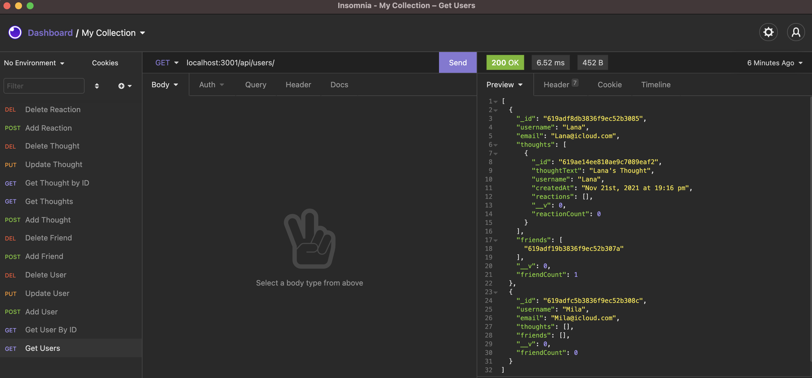

# NoSQL-social-network-API

## Description

- This application's purpose is to provide an api for a social networking application.

[Walkthrough Video](https://watch.screencastify.com/v/U5ehzV8PNOJWTrJYF58T)

## Installation

Clone the repository to your local computer and navigate to the repo in your terminal. Ensure you have NoSQL installed and running and to run 'npm install' in your terminal to install all necessary dependencies. Run 'npm start' to start from the root of the directory to run the server and you will be all set to run routes in insomnia or another application to run API routes.

## Usage

This application is intended to manage a NoSQL database holding social networking information. Users are able to add, delete, and/or update users, user friends, thoughts, and reactions to thoughts to the database,

## Built with:

- MongoDB
- Mongoose
- Node.js
- Express.js

## This application can be found:

- [Repository](https://github.com/michellewehr/NoSQL-social-network-API)

## Contribution

Anyone is welcome to contribute to this project. To do so, clone the local repository to your local workspace, create a git feature branch and request a pull request. Upon review, the pull request will then be accepted or denied.

## Sources

- This project was inspired by UCONN's School of Engineering Coding Bootcamp.

## Author

Michelle Wehr
